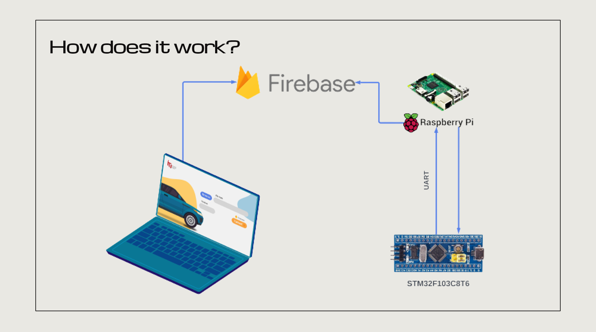

# Firmware Over The Air (FOTA) Implementation

This project showcases a straightforward implementation of Firmware Over The Air (FOTA) updates, leveraging cloud services to send updates which are then parsed by a Raspberry Pi 3B+ client.

## Benefits of FOTA
- **Bug and Security Fixes:** Allows for the swift rectification of software vulnerabilities.
- **Functionality Improvements:** Enhances system functions over time without needing hardware adjustments.
- **Version Updates:** Seamlessly updates firmware versions without physical intervention.

## Overview

Updates can be uploaded to a cloud server (Firebase). The Raspberry Pi, acting as the main Microcontroller Unit (MCU), listens to real-time database changes. Upon detecting a valid update, a GUI notifies the user about the available update, providing options to either initiate the update immediately or postpone it. If the user chooses to proceed, the Raspberry Pi transfers the new hex file to the target microcontroller (STMF10) via UART. The progress and status of the update are reflected in the Raspberry Pi's GUI.

Once the update process concludes, the new application activates on the target STMF10, and the GUI confirms the update's successful installation.

[**Demo Video**](https://youtu.be/YTyh6CloR7g)

<iframe width="560" height="315" src="https://www.youtube.com/embed/YTyh6CloR7g" frameborder="0" allowfullscreen></iframe>

## Components

1. **Cloud Server (Firebase)**:
   - Firebase is chosen for its real-time database, encryption capabilities, and Python integration.
   - Provides a platform for uploading hex files using a dedicated GUI.

2. **Desktop GUI**: 
   - Designed with Python and Tkinter.
   - Facilitates the upload of update files to the server.

        

3. **Raspberry Pi (Main MCU)**:
   - Automatically polls the database for updates.
   - Fetches and parses new hex files from the server when detected.
   - Guides users through the update process, including safety checks and update status.

        

4. **Bootloader**:
   - Responsible for memory management, featuring Bootloader (BL), Bank 1, and Bank 2 sections.
   - Manages update sequence, deciding between existing or new applications based on switch states and update availability.

## Accreditation

This project was crafted to fulfill the prerequisites of an intensive code camp diploma in Embedded Systems Engineering, organized by the Information Technology Institute (ITI), Egypt. Covered topics included:
- C Programming for Embedded Systems
- Embedded Systems Concepts & Interfacing (AVR + ARM)
- Real Time Operating Systems & Testing
- Embedded Systems Tooling
- Automotive Bus Technology
- Python Programming
- Embedded Linux on RPI
- Introduction to AUTOSAR

## Team Members
- Ahmed Ashry
- Mahmoud Khalil
- Mahmoud Abdullah
- Salma Ali Sami
- Nardin Nader

